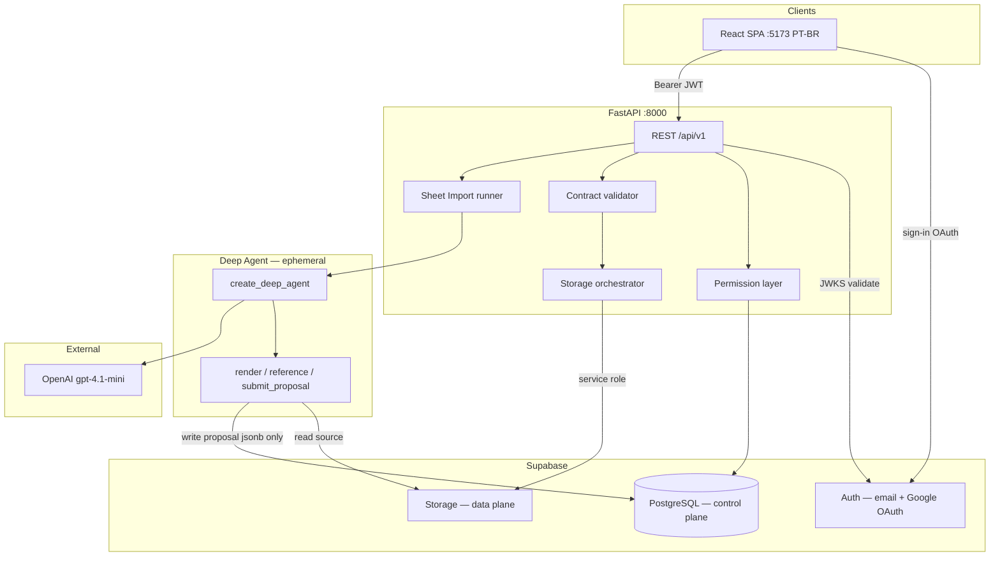
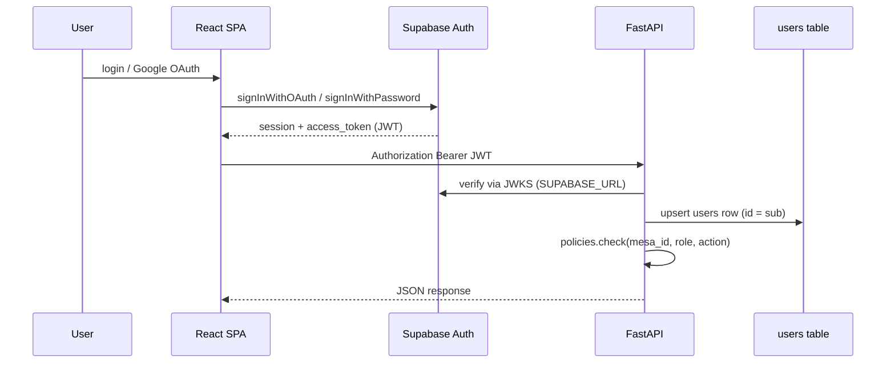

# Architecture Memory — RPG Platform MVP

> **Epic:** RPG-1 · **Status:** Architecture complete · **Date:** 2026-06-11  
> **Authority:** [rpg-platform-overview.md](../../docs/architecture/rpg-platform-overview.md) · ADR-011..015 · [docs/product/](../../docs/product/)

## Current State

| Area | Status |
|------|--------|
| Product specs | Frozen — 15 files in `docs/product/` |
| ADRs | ADR-011..015 accepted |
| `app/` | **Greenfield** — no product code yet (RPG-2 starts scaffold) |
| Legacy Investment Radar | Superseded (ADR-015); docs only |
| Studio Service | Orthogonal SDLC control plane — not RPG MVP scope |
| SDLC obs | `app/infra/sdlc_obs/` — separate from product |

**Active product:** RPG Platform — campaign management (Mesa sandbox, sheet import, documents, dynamic fichas).

---

## System Diagram



**Data split:** Postgres = who/what/where/permissions/versions. Storage = JSON envelopes, Markdown, media.

---

## Module Map

```
app/
├── backend/                    # FastAPI — sole product API (ADR-015)
│   └── src/rpg_platform/
│       ├── main.py             # app factory, lifespan, CORS
│       ├── config.py           # pydantic-settings (env)
│       ├── api/
│       │   ├── deps.py         # get_db, get_current_user, require_mesa_access
│       │   └── v1/routes/      # one router file per domain
│       ├── auth/               # JWT/JWKS, user sync
│       ├── db/                 # SQLAlchemy models, session
│       ├── policies/           # mesa membership, visibility resolvers
│       ├── services/           # domain + storage + manifest
│       ├── contracts/          # envelope builder, jsonschema validate
│       └── agents/sheet_import/  # Deep Agent — isolated from HTTP except runner
│
├── frontend/                   # React + Vite + TypeScript
│   └── src/
│       ├── lib/supabase.ts     # Auth client only
│       ├── lib/api.ts          # fetch + Bearer from session
│       ├── features/           # auth, mesas, import, sheets, documents, admin
│       └── components/         # sheet form renderer, doc editor
│
├── shared/                     # Cross-stack contracts (no runtime deps)
│   ├── contracts/              # *.v1.schema.json — CI validated
│   └── seeds/dnd5e/            # platform seed schema.json
│
└── infra/
    ├── supabase/               # config.toml, migrations/, seed.sql
    └── sdlc_obs/               # SDLC metrics (unchanged)
```

| Module | Owner | Boundary |
|--------|-------|----------|
| **Auth bridge** | backend `auth/` | Validates JWT; syncs `users` row; no custom passwords |
| **Mesas** | backend `services/mesas.py` | Lifecycle, settings, master cap (BR-01) |
| **Import** | backend `agents/` + `services/sheet_import_jobs.py` | Agent proposes; API persists on approve only |
| **Storage** | backend `services/storage.py` | All bucket I/O; signed URLs; compensating deletes |
| **Permissions** | backend `policies/` | Mesa-scoped; not a public router |
| **Contracts** | backend + `app/shared/contracts/` | Validate before any Storage write |
| **Frontend auth** | frontend `lib/supabase.ts` | Login/OAuth only; all data via FastAPI |

---

## Auth Bridge



| Concern | Decision |
|---------|----------|
| Identity source | Supabase Auth only (ADR-011) |
| `users.id` | Same UUID as `auth.users.id` |
| Profile sync | `POST /api/v1/auth/sync` on first API call or explicit after login |
| Suspended users | Reject all routes if `users.status != active` (BR-27) |
| Admin | `users.is_admin` — global bypass in policies |
| Storage credentials | Never issued to browser for `campaigns` bucket (BR-31) |
| Signed URL reads | 1h TTL for permitted media/attachments (Q-020) |

**Frontend:** `@supabase/supabase-js` for auth session only. **Backend:** `SUPABASE_SERVICE_ROLE_KEY` for Storage writes; JWT for user identity.

---

## API Route List (`/api/v1`)

Standard error envelope: `{ "error": { "code", "message", "details" } }` (ADR-008).

### Health

| Method | Path | Auth | Notes |
|--------|------|------|-------|
| GET | `/health` | none | Liveness + DB ping |

### Auth & Users

| Method | Path | Auth | Notes |
|--------|------|------|-------|
| POST | `/auth/sync` | JWT | Upsert profile from claims |
| GET | `/auth/me` | JWT | Current user + admin flag |
| GET | `/users/me` | JWT | Profile detail |
| PATCH | `/users/me` | JWT | display_name |
| POST | `/users/me/avatar` | JWT | Upload → `profiles/{id}/avatar.*` |

### Mesas

| Method | Path | Auth | Policy |
|--------|------|------|--------|
| GET | `/mesas` | JWT | List where participant or admin |
| POST | `/mesas` | JWT | Master cap check; status=`importing` |
| GET | `/mesas/{mesa_id}` | JWT | Member or admin |
| PATCH | `/mesas/{mesa_id}` | JWT | Master |
| POST | `/mesas/{mesa_id}/pause` | JWT | Master |
| POST | `/mesas/{mesa_id}/activate` | JWT | Master |
| POST | `/mesas/{mesa_id}/archive` | JWT | Master |

### Sheet Import (Mesa bootstrap)

| Method | Path | Auth | Policy |
|--------|------|------|--------|
| POST | `/mesas/{mesa_id}/import` | JWT | Master; enqueue job |
| GET | `/mesas/{mesa_id}/import` | JWT | Master; job + proposal |
| PATCH | `/mesas/{mesa_id}/import/proposal` | JWT | Master; edit proposal |
| POST | `/mesas/{mesa_id}/import/approve` | JWT | Master; persist contracts |
| POST | `/mesas/{mesa_id}/import/reject` | JWT | Master |
| POST | `/mesas/{mesa_id}/import/seed` | JWT | Master; dnd5e fallback |
| GET | `/mesas/{mesa_id}/import/stream` | JWT | Master; SSE progress (optional MVP) |

### Participants & Invites

| Method | Path | Auth | Policy |
|--------|------|------|--------|
| GET | `/mesas/{mesa_id}/participants` | JWT | Member |
| DELETE | `/mesas/{mesa_id}/participants/{id}` | JWT | Master |
| GET | `/mesas/{mesa_id}/invites` | JWT | Master |
| POST | `/mesas/{mesa_id}/invites` | JWT | Master; 7-day token |
| DELETE | `/mesas/{mesa_id}/invites/{id}` | JWT | Master |
| POST | `/invites/accept` | JWT | Body: token; email match (BR-15) |

### Sheet Templates

| Method | Path | Auth | Policy |
|--------|------|------|--------|
| GET | `/mesas/{mesa_id}/templates` | JWT | Member |
| POST | `/mesas/{mesa_id}/templates` | JWT | Master |
| GET | `/mesas/{mesa_id}/templates/{id}` | JWT | Member |
| PATCH | `/mesas/{mesa_id}/templates/{id}` | JWT | Master |
| GET | `/mesas/{mesa_id}/templates/{id}/schema` | JWT | Member; inline or signed URL |
| GET | `/mesas/{mesa_id}/templates/{id}/versions` | JWT | Member |

### Character Sheets

| Method | Path | Auth | Policy |
|--------|------|------|--------|
| GET | `/mesas/{mesa_id}/characters` | JWT | Visibility filter |
| POST | `/mesas/{mesa_id}/characters` | JWT | Player+; from template |
| GET | `/mesas/{mesa_id}/characters/{id}` | JWT | Visibility |
| PATCH | `/mesas/{mesa_id}/characters/{id}` | JWT | Owner or Master |
| GET | `/mesas/{mesa_id}/characters/{id}/data` | JWT | Visibility |
| PUT | `/mesas/{mesa_id}/characters/{id}/data` | JWT | Owner or Master; validates vs template |
| POST | `/mesas/{mesa_id}/characters/{id}/media` | JWT | Owner or Master |
| GET | `/mesas/{mesa_id}/characters/{id}/versions` | JWT | Visibility |

### Documents

| Method | Path | Auth | Policy |
|--------|------|------|--------|
| GET | `/mesas/{mesa_id}/documents` | JWT | Visibility filter + search |
| POST | `/mesas/{mesa_id}/documents` | JWT | Master (MVP); character_story by Player |
| GET | `/mesas/{mesa_id}/documents/{id}` | JWT | can_read_document |
| PATCH | `/mesas/{mesa_id}/documents/{id}` | JWT | Master or owner rules |
| DELETE | `/mesas/{mesa_id}/documents/{id}` | JWT | Soft delete |
| GET | `/mesas/{mesa_id}/documents/{id}/content` | JWT | can_read_document |
| PUT | `/mesas/{mesa_id}/documents/{id}/content` | JWT | Editor permission |
| POST | `/mesas/{mesa_id}/documents/{id}/attachments` | JWT | Editor |
| GET | `/mesas/{mesa_id}/documents/search` | JWT | `?q=` basic text |

### Admin

| Method | Path | Auth | Policy |
|--------|------|------|--------|
| GET | `/admin/users` | JWT | is_admin |
| PATCH | `/admin/users/{id}/status` | JWT | is_admin |
| GET | `/admin/mesas` | JWT | is_admin |
| GET | `/admin/audit-events` | JWT | is_admin |

OpenAPI: `/api/v1/openapi.json`.

---

## DB Migration Strategy

| Layer | Source of truth | Tooling |
|-------|-----------------|---------|
| DDL (enums, tables, triggers) | `app/infra/supabase/migrations/` | Supabase CLI `supabase db reset` / `migration up` |
| ORM models | `app/backend/src/rpg_platform/db/models/` | SQLAlchemy 2.0 async — hand-synced to migrations |
| Runtime driver | `asyncpg` via `DATABASE_URL` | Points at Supabase local Postgres |
| Seed auth users | Supabase Auth + optional `seed.sql` | Dev fixtures only |

**Initial migration:** single file `00001_rpg_platform_schema.sql` generated from [database-schema.md](../../docs/product/database-schema.md) — all enums, tables, indexes, triggers (`check_master_mesa_limit`, `one_master_per_mesa`).

**Backend session:** async SQLAlchemy; no `create_all` in production path.

**Drift control (RPG-3):** pytest or script compares model `__table__` names/columns against migration SQL (warn in CI; fail on epic Done).

**RLS:** not in MVP migrations — FastAPI policies only (ADR-011). Add RLS migration in v1.1 as defense-in-depth.

**Auth FK:** `users.id` references `auth.users(id)` — migration runs in Supabase context where `auth` schema exists.

---

## Storage Paths

Buckets: `profiles`, `campaigns` (ADR-012).

```
profiles/
└── {user_id}/avatar.{webp|png|jpg}

campaigns/
└── {mesa_id}/
    ├── import/source.{pdf|png|jpg|webp}
    ├── manifest.json
    ├── templates/{template_id}/
    │   ├── schema.json
    │   └── versions/v{n}.json
    ├── characters/{sheet_id}/
    │   ├── data.json
    │   ├── meta.json
    │   ├── versions/v{n}.json
    │   └── media/{field_key}.{ext}
    ├── documents/{document_id}/
    │   ├── content.md | content.json
    │   ├── meta.json
    │   ├── versions/v{n}.{md|json}
    │   └── attachments/{filename}
    └── assets/{asset_id}.{ext}
```

### Write orchestration (Storage service)

```
1. Authorize (policies)
2. Validate envelope + JSON Schema (contracts/)
3. BEGIN postgres transaction
4. Copy prior file → versions/ if version bump
5. PUT new object (service role)
6. Upsert storage_files (checksum_sha256)
7. Update entity row + *_versions + audit_events
8. COMMIT
9. Regenerate manifest.json (sync or background task)
-- on PG failure: compensating delete of new Storage objects
```

**Agent boundary:** reads `import/source.*` only; writes **never** to `campaigns/` — proposal lands in `sheet_import_jobs.proposal` (jsonb).

**Ephemeral workspace:** `/tmp/rpg-import/{job_id}/` or in-memory — page PNGs for vision; deleted after job terminal state.

---

## Agent Runner Boundaries

| In scope | Out of scope |
|----------|--------------|
| `create_deep_agent(model=AGENT_MODEL)` | Direct Supabase Storage writes |
| Custom tools: render, reference, analyze, submit_proposal | Persisting templates/sheets |
| Subagents via `task`: classifier, layout, mapper | Other Mesa context |
| Job states: pending → processing → proposed/failed | Auto-approve |
| 120s timeout; 5 imports/Mesa/hour rate limit | LangSmith (optional off) |
| Proposal validates against `sheet-import-proposal.v1` | Post-MVP re-import |

**Package:** `app/backend/src/rpg_platform/agents/sheet_import/` — `agent.py`, `tools.py`, `runner.py`, `models.py`, `references/dnd5e_2024.json`.

**Invocation:** `BackgroundTasks` or asyncio task from `POST .../import`; update `sheet_import_jobs.status` in runner finally block.

**Approval path:** `services/sheet_import_jobs.approve()` — converts proposal → envelopes → Storage + DB (shared with seed fallback).

---

## Cross-Cutting Concerns

| Concern | Approach |
|---------|----------|
| **Mesa isolation** | Every query filters `mesa_id`; path prefix validation on Storage |
| **Authorization** | `policies/` — membership, role, document visibility, sheet visibility |
| **Contracts** | jsonschema on write; reject 422; `storage_files` mirrors envelope meta |
| **Versioning** | Copy to `versions/v{n}.*` + `*_versions` row on each save |
| **Audit** | `audit_events` on mutations (sheet, document, role, import approve) |
| **Errors** | Consistent JSON error body; no stack traces in prod |
| **Logging** | Structured: `request_id`, `user_id`, `mesa_id`, `route` |
| **CORS** | `http://localhost:5173` dev; env-driven origins |
| **i18n** | PT-BR hardcoded frontend strings (BR-32) |
| **Rate limits** | Import: 5/hour/Mesa; general limits post-MVP |

---

## Risks & Mitigations

| Risk | Impact | Mitigation |
|------|--------|------------|
| Agent low accuracy on scans | Bad templates | Confidence UI; seed fallback; human approve gate |
| Storage + PG split-brain | Orphan files | Transaction order + compensating delete |
| JWT clock skew / JWKS cache | Auth flaps | Cache JWKS 1h; clear error codes |
| Large PDF multi-page | Timeout | 120s limit; page cap; async job + poll |
| Schema drift ORM vs SQL | Runtime errors | RPG-2 migration as DDL truth; CI drift check |
| Master cap bypass | Abuse | DB trigger + `master_mesa_count` denorm |
| PII in import files | Privacy | Master-only access; same retention as campaign |
| OpenAI outage | Blocked bootstrap | Seed fallback path; clear failed status |
| Greenfield replaces legacy | Confusion | ADR-015; remove/replace old `marketpulse` when implementing |

---

## Child Card Implementation Notes

### RPG-2 — INFRA (`feature/RPG-2-infra-supabase-contracts`)

**Do first.** Blocks RPG-3.

| Deliverable | Path |
|-------------|------|
| Supabase project config | `app/infra/supabase/config.toml` |
| Initial DDL migration | `app/infra/supabase/migrations/00001_rpg_platform_schema.sql` |
| Bucket definitions | migration or `storage.buckets` seed |
| JSON Schemas (7 contracts) | `app/shared/contracts/*.v1.schema.json` |
| D&D 5e seed envelope | `app/shared/seeds/dnd5e/schema.json` |
| D&D reference JSON for agent | `app/shared/references/dnd5e_2024.json` (from product doc) |
| Env template | `.env.example` — `SUPABASE_*`, `DATABASE_URL`, `AGENT_MODEL` |
| Makefile targets | `supabase-start`, `supabase-stop`, `contracts-validate` |
| CI step | jsonschema validate seeds + example envelopes |

**Exit criteria:** `supabase start` + `make contracts-validate` green; buckets `profiles`, `campaigns` exist.

**Do not:** FastAPI routes, React app, agent code.

---

### RPG-3 — BACKEND (`feature/RPG-3-backend-api-mesas-agent`)

**Depends on RPG-2.** Single vertical slice through import approve before documents polish.

| Phase | Scope |
|-------|-------|
| 3a Foundation | `main.py`, config, db session, auth JWT + sync, health |
| 3b Mesas + import | Mesa CRUD, import upload, agent runner, approve/reject/seed |
| 3c Core domain | Participants, invites, templates, characters, documents |
| 3d Storage + admin | Storage service, manifest regen, admin routes, audit |

| Deliverable | Path |
|-------------|------|
| Package root | `app/backend/src/rpg_platform/` |
| Routers | `api/v1/routes/*.py` per route table above |
| Policies | `policies/mesa.py`, `policies/document.py`, `policies/sheet.py` |
| Agent | `agents/sheet_import/*` |
| Tests | `app/backend/tests/` — auth, mesa cap, import mock agent, contract reject |

**pyproject.toml adds:** `asyncpg`, `python-jose` or `PyJWT`, `supabase` (or httpx storage client), `deepagents`, `langchain-openai`, `pymupdf`, `jsonschema`.

**Exit criteria:** OpenAPI complete; Journey 1 API-only (create mesa → import → approve → invite) passes integration tests with mocked OpenAI.

---

### RPG-4 — FRONTEND (`feature/RPG-4-frontend-auth-mesa-sheets`)

**Depends on RPG-3** (can stub API during early dev).

| Phase | Scope |
|-------|-------|
| 4a Shell | Vite React TS, router, supabase auth, api client |
| 4b Bootstrap | Mesa create, import upload, review UI (side-by-side), seed fallback |
| 4c Sheets | Dynamic form renderer from `schema.json`; character CRUD |
| 4d Wiki + admin | Document list/editor, visibility controls; admin read-only lists |

| Deliverable | Path |
|-------------|------|
| Auth pages | `features/auth/` — login, register, OAuth callback |
| Mesa flows | `features/mesas/`, `features/import/` |
| Sheet renderer | `components/sheet/SheetForm.tsx` — field types from contract enum |
| Documents | `features/documents/` — markdown editor |
| i18n | PT-BR strings inline (no i18n lib) |

**Exit criteria:** MVP journeys 1–3 in [mvp-scope.md](../../docs/product/mvp-scope.md) pass manually against local stack.

---

## Implementation Order

```
RPG-2 (INFRA) → RPG-3 (BACKEND) → RPG-4 (FRONTEND)
```

Within RPG-3: auth → mesas/import → participants/invites → templates/characters → documents → admin.

Within RPG-4: auth shell → import review → sheet renderer → documents → admin minimal.

---

## Orthogonal Systems (unchanged)

| System | Doc | Notes |
|--------|-----|-------|
| Studio Service | [studio-service-platform.md](../../docs/architecture/studio-service-platform.md) | `/studio/*`, propose-only — not RPG MVP |
| SDLC obs | `app/infra/sdlc_obs/` | Separate SQLite |
| SDLC hooks/gates | `.sdlc/`, `.cursor/` | Product writes require child card gate |

---

## Design Principles

1. Mesa isolation — every query and Storage path scoped by `mesa_id`
2. Contracts first — validate before persist
3. API-mediated Storage — no direct client writes to `campaigns`
4. Human-in-the-loop import — agent proposes; Master approves
5. Vertical slices — ship import path before wiki polish

## Open Questions (architecture)

- None blocking MVP — all resolved in [open-questions.md](../../docs/product/open-questions.md) (2026-06-11)
