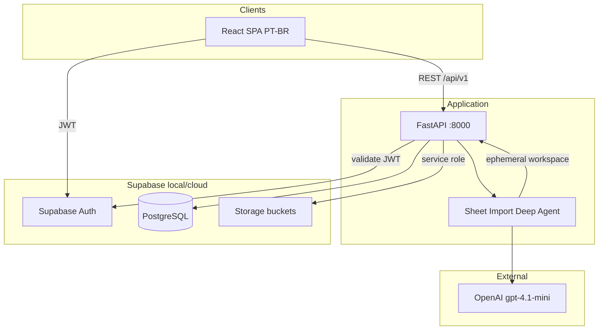

# RPG Platform — Architecture Overview

> **Product:** RPG Platform — campaign management for tabletop RPG groups  
> **Phase:** Architecture approved for implementation planning  
> **Date:** 2026-06-11  
> **Product specs:** [`docs/product/`](../product/README.md)

## Summary

Web platform where each **Mesa** (campaign) is an isolated sandbox. Masters bootstrap Mesas by uploading a character sheet (PDF/PNG); a **Deep Agent** proposes sheet templates. Content lives in **Supabase Storage**; **PostgreSQL** holds metadata, permissions, and integrity pointers.

## System context



## Repository layout

```
rpg-ai/
├── app/
│   ├── backend/src/rpg_platform/   # FastAPI — API + agent runner
│   ├── frontend/src/               # React + Vite + TypeScript (PT-BR)
│   ├── shared/
│   │   ├── contracts/              # JSON Schema (*.v1.schema.json)
│   │   ├── seeds/dnd5e/            # Platform seed schema.json
│   │   └── references/             # Agent glossaries (dnd5e_2024.json)
│   └── infra/
│       ├── supabase/               # config.toml, migrations/, seed.sql
│       └── sdlc_obs/               # SDLC metrics (orthogonal)
├── docs/
│   ├── product/          # Product refinement (source of truth for MVP)
│   └── architecture/     # This file + ADRs
├── .sdlc/                # SDLC operating system (unchanged)
└── .cursor/              # Agent configuration
```

## Database migrations

| Concern | Decision |
|---------|----------|
| DDL source of truth | `app/infra/supabase/migrations/` — applied via Supabase CLI |
| Initial migration | `00001_rpg_platform_schema.sql` from [database-schema.md](../product/database-schema.md) |
| ORM | SQLAlchemy 2.0 async in backend — models hand-synced to migrations |
| Driver | `asyncpg` via `DATABASE_URL` (Supabase Postgres) |
| RLS | Deferred to v1.1 — FastAPI policy layer for MVP (ADR-011) |

## Core architectural decisions

| Area | Decision | ADR |
|------|----------|-----|
| Backend | Python 3.11+ · FastAPI · Pydantic v2 | ADR-002, ADR-004 |
| Frontend | React · Vite · TypeScript | ADR-005 |
| Auth | Supabase Auth — email + Google OAuth | ADR-011 |
| Database | Supabase PostgreSQL — metadata only | ADR-011 |
| Content store | Supabase Storage — JSON sheets, Markdown, media | ADR-012 |
| API prefix | `/api/v1/` · OpenAPI | ADR-008 (superseded for auth) |
| Mesa bootstrap | LangChain Deep Agents + `gpt-4.1-mini` | ADR-013 |
| JSON payloads | Versioned envelopes + JSON Schema | ADR-014 |
| Authorization | FastAPI policy layer (RLS deferred) | ADR-011 |

## Data plane vs control plane

| Plane | Technology | Contents |
|-------|------------|----------|
| **Control** | PostgreSQL | users, mesas, participants, invites, permissions, `storage_files`, versions, audit |
| **Data** | Storage `campaigns/{mesa_id}/` | `schema.json`, `data.json`, `content.md`, media |
| **Auth** | Supabase Auth | Identity; `users.id` = `auth.users.id` |

See [storage-layout.md](../product/storage-layout.md) and [database-schema.md](../product/database-schema.md).

## Backend modules

| Module | Router prefix | Responsibility |
|--------|---------------|----------------|
| Auth | `/api/v1/auth` | Session bridge, profile sync |
| Users | `/api/v1/users` | Profile, avatar |
| Mesas | `/api/v1/mesas` | CRUD, settings, status lifecycle |
| Import | `/api/v1/mesas/{id}/import` | Upload, agent job, approve |
| Participants | `/api/v1/mesas/{id}/participants` | Membership |
| Invites | `/api/v1/mesas/{id}/invites` | 7-day single-use tokens |
| Templates | `/api/v1/mesas/{id}/templates` | Sheet template metadata |
| Characters | `/api/v1/mesas/{id}/characters` | Character sheet metadata |
| Documents | `/api/v1/mesas/{id}/documents` | Lore, stories, visibility |
| Storage | internal | Signed URLs, upload orchestration |
| Admin | `/api/v1/admin` | Users, mesas overview |

## Mesa lifecycle

```
importing ──(import approved)──► active ⇄ paused ──► finished ──► archived
```

Creation always starts `importing` until sheet template is approved or seed fallback applied.

## Sheet Import pipeline

1. Master uploads PDF/PNG → `campaigns/{mesa_id}/import/source.*`
2. `sheet_import_jobs` row → Deep Agent (`create_deep_agent`, `AGENT_MODEL`)
3. Agent tools: render pages, load D&D reference, analyze, `submit_import_proposal`
4. Job → `proposed`; Master reviews in UI
5. Approve → validate contracts → write Storage + Postgres → Mesa `active`

Detail: [sheet-import-agent.md](../product/sheet-import-agent.md).

## Security model

| Layer | MVP |
|-------|-----|
| Authentication | Supabase JWT; Google OAuth required |
| Authorization | FastAPI — Mesa membership + role + document visibility |
| Storage access | API service role only; signed URLs 1h TTL for reads |
| Invite | Token hashed in DB; email match on accept |
| Isolation | All queries scoped by `mesa_id` |

## Frontend architecture

- **SPA** on Vite `:5173`
- **Auth:** `@supabase/supabase-js` for login/OAuth
- **API:** `fetch` or TanStack Query → FastAPI with Bearer token
- **i18n:** PT-BR hardcoded strings MVP; no i18n framework yet
- **Key flows:** Mesa create + import review, document wiki, dynamic sheet form renderer from `schema.json`

## Local development

```bash
supabase start                    # Postgres + Auth + Storage
# FastAPI with DATABASE_URL + SUPABASE_* env
cd app/frontend && npm run dev    # :5173
```

Env: `AGENT_MODEL`, `OPENAI_API_KEY`, `SUPABASE_URL`, `SUPABASE_SERVICE_ROLE_KEY`, `DATABASE_URL`.

## Observability

- Structured logs per request (`mesa_id`, `user_id`, `route`)
- `audit_events` table for domain mutations
- LangSmith optional (off default) for import agent traces
- SDLC obs (`app/infra/sdlc_obs/`) — separate from product

## Implementation order

Plane children (sequential):

| Order | Card | Scope |
|-------|------|-------|
| 1 | **RPG-2 INFRA** | Supabase local, migrations, buckets, `app/shared/contracts/`, seeds, env, CI schema validation |
| 2 | **RPG-3 BACKEND** | Auth bridge, mesas, import agent, storage orchestration, participants, invites, templates, characters, documents, admin |
| 3 | **RPG-4 FRONTEND** | Auth UI, Mesa bootstrap + import review, sheet renderer, document wiki, admin minimal |

Within RPG-3: auth → mesas/import → membership → templates/characters → documents → admin.

Agent memory: [`.sdlc/memory/architecture.md`](../../.sdlc/memory/architecture.md) — full API route list and module boundaries.

## Out of scope (MVP)

Dice, combat, VTT, chat, computed sheet fields, i18n, RLS, import-after-bootstrap.

## Related documents

| Doc | Path |
|-----|------|
| Product index | [docs/product/README.md](../product/README.md) |
| JSON contracts | [docs/product/json-contracts.md](../product/json-contracts.md) |
| DB schema | [docs/product/database-schema.md](../product/database-schema.md) |
| ADRs | [decisions.md](./decisions.md) |
| SDLC Studio | [studio-service-platform.md](./studio-service-platform.md) (orthogonal) |
