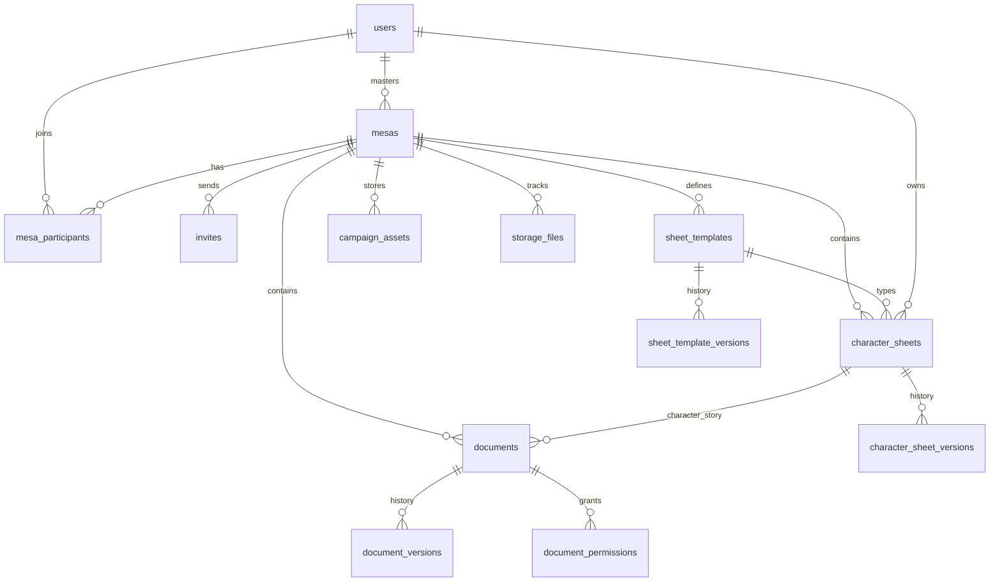

# Database Schema — PostgreSQL (Supabase)

> **Status:** Accepted (refinement)  
> **Date:** 2026-06-11  
> **Related:** [json-contracts.md](./json-contracts.md), [domain-model.md](./domain-model.md)

## Design principles

1. **Postgres = control plane** — identity, membership, permissions, indexes, version pointers.
2. **Storage = data plane** — JSON/markdown/binary payloads under `campaigns/{mesa_id}/`.
3. **`storage_files`** — one row per Storage object; enforces contract + checksum integrity.
4. **Mesa isolation** — every campaign-scoped table has `mesa_id`; composite indexes lead with `mesa_id`.
5. **No JSON blobs in entity tables** — only enums, caches, and FK-safe metadata.

## ER diagram



## Extensions

```sql
CREATE EXTENSION IF NOT EXISTS "pgcrypto";
CREATE EXTENSION IF NOT EXISTS "citext";
```

## Enums

```sql
CREATE TYPE user_status AS ENUM ('active', 'suspended', 'deleted');
CREATE TYPE mesa_status AS ENUM ('importing', 'active', 'paused', 'finished', 'archived');
CREATE TYPE import_job_status AS ENUM ('pending', 'processing', 'proposed', 'approved', 'rejected', 'failed');
CREATE TYPE participant_role AS ENUM ('master', 'player');
CREATE TYPE participant_status AS ENUM ('pending', 'active', 'removed', 'left');
CREATE TYPE invite_status AS ENUM ('pending', 'accepted', 'expired', 'cancelled');
CREATE TYPE template_status AS ENUM ('active', 'archived');
CREATE TYPE sheet_status AS ENUM ('active', 'dead', 'retired', 'archived');
CREATE TYPE sheet_visibility AS ENUM ('owner_only', 'mesa_masters', 'all_players');
CREATE TYPE document_type AS ENUM (
  'rule', 'campaign_story', 'lore', 'npc', 'location', 'item', 'monster',
  'organization', 'session', 'summary', 'freeform', 'character_story',
  'attachment', 'external_link'
);
CREATE TYPE document_visibility AS ENUM (
  'master_only', 'all_players', 'specific_players', 'specific_character', 'owner_private'
);
CREATE TYPE content_format AS ENUM ('markdown', 'structured_json');
CREATE TYPE storage_resource_type AS ENUM (
  'sheet_template', 'character_sheet', 'document', 'campaign_asset', 'manifest'
);
CREATE TYPE permission_grantee_type AS ENUM ('user', 'character');
```

---

## Table: `users`

Mirror of Supabase Auth profile. PK matches `auth.users.id`.

| Column | Type | Constraints |
|--------|------|-------------|
| `id` | `uuid` | PK, FK → `auth.users(id)` ON DELETE CASCADE |
| `email` | `citext` | NOT NULL, UNIQUE |
| `display_name` | `varchar(120)` | NOT NULL |
| `avatar_storage_path` | `text` | NULL — `profiles/{id}/avatar.webp` |
| `status` | `user_status` | NOT NULL DEFAULT `'active'` |
| `is_admin` | `boolean` | NOT NULL DEFAULT `false` |
| `master_mesa_count` | `smallint` | NOT NULL DEFAULT `0` — denormalized cap enforcement |
| `created_at` | `timestamptz` | NOT NULL DEFAULT `now()` |
| `updated_at` | `timestamptz` | NOT NULL DEFAULT `now()` |
| `last_login_at` | `timestamptz` | NULL |

**Indexes:** `email` (unique), `status`.

**Trigger:** `master_mesa_count` updated on Mesa create/delete/archive.

---

## Table: `mesas`

| Column | Type | Constraints |
|--------|------|-------------|
| `id` | `uuid` | PK DEFAULT `gen_random_uuid()` |
| `name` | `varchar(120)` | NOT NULL |
| `description` | `text` | NULL |
| `rpg_system` | `varchar(80)` | NOT NULL |
| `status` | `mesa_status` | NOT NULL DEFAULT `'importing'` |
| `master_id` | `uuid` | NOT NULL, FK → `users(id)` |
| `settings` | `jsonb` | NOT NULL — validated against `mesa-settings.v1` schema |
| `storage_root` | `text` | NOT NULL — `campaigns/{id}` |
| `manifest_storage_path` | `text` | NOT NULL — `campaigns/{id}/manifest.json` |
| `created_at` | `timestamptz` | NOT NULL DEFAULT `now()` |
| `updated_at` | `timestamptz` | NOT NULL DEFAULT `now()` |

**Indexes:** `(master_id)`, `(status)`, `(master_id, status)`.

**Constraints:**

```sql
-- Max 2 active mesas as master per user (BR-01)
CREATE OR REPLACE FUNCTION check_master_mesa_limit() ...
-- Enforced via trigger + users.master_mesa_count
```

**`settings` JSON contract:**

```json
{
  "players_can_edit_own_sheet": true,
  "players_can_view_other_sheets": false,
  "character_story_requires_approval": false,
  "seed_dnd5e_template": true
}
```

---

## Table: `mesa_participants`

| Column | Type | Constraints |
|--------|------|-------------|
| `id` | `uuid` | PK DEFAULT `gen_random_uuid()` |
| `mesa_id` | `uuid` | NOT NULL, FK → `mesas(id)` ON DELETE CASCADE |
| `user_id` | `uuid` | NOT NULL, FK → `users(id)` ON DELETE CASCADE |
| `role` | `participant_role` | NOT NULL |
| `status` | `participant_status` | NOT NULL DEFAULT `'pending'` |
| `joined_at` | `timestamptz` | NULL |
| `created_at` | `timestamptz` | NOT NULL DEFAULT `now()` |
| `updated_at` | `timestamptz` | NOT NULL DEFAULT `now()` |

**Unique:** `(mesa_id, user_id)`.

**Indexes:** `(mesa_id, status)`, `(user_id, status)`, `(mesa_id, role)`.

**Rule:** Exactly one row with `role = 'master'` per `mesa_id` (partial unique index or trigger).

```sql
CREATE UNIQUE INDEX one_master_per_mesa ON mesa_participants (mesa_id)
  WHERE role = 'master' AND status = 'active';
```

---

## Table: `invites`

| Column | Type | Constraints |
|--------|------|-------------|
| `id` | `uuid` | PK DEFAULT `gen_random_uuid()` |
| `mesa_id` | `uuid` | NOT NULL, FK → `mesas(id)` ON DELETE CASCADE |
| `email` | `citext` | NOT NULL |
| `token_hash` | `text` | NOT NULL, UNIQUE — store SHA-256 of token, never plain token |
| `status` | `invite_status` | NOT NULL DEFAULT `'pending'` |
| `expires_at` | `timestamptz` | NOT NULL — `created_at + interval '7 days'` |
| `used_at` | `timestamptz` | NULL |
| `accepted_by` | `uuid` | NULL, FK → `users(id)` |
| `created_by` | `uuid` | NOT NULL, FK → `users(id)` |
| `created_at` | `timestamptz` | NOT NULL DEFAULT `now()` |

**Indexes:** `(mesa_id, status)`, `(token_hash)`, `(email, mesa_id)`.

---

## Table: `sheet_import_jobs`

Tracks AI import pipeline during Mesa bootstrap. See [sheet-import-agent.md](./sheet-import-agent.md).

| Column | Type | Constraints |
|--------|------|-------------|
| `id` | `uuid` | PK DEFAULT `gen_random_uuid()` |
| `mesa_id` | `uuid` | NOT NULL, FK → `mesas(id)` ON DELETE CASCADE |
| `created_by` | `uuid` | NOT NULL, FK → `users(id)` |
| `status` | `import_job_status` | NOT NULL DEFAULT `'pending'` |
| `source_storage_path` | `text` | NOT NULL |
| `source_mime` | `varchar(127)` | NOT NULL |
| `detected_system` | `varchar(40)` | NULL — `dnd5e_2024`, `dnd5e_2014`, `custom` |
| `proposal` | `jsonb` | NULL — agent output |
| `result_template_id` | `uuid` | NULL, FK → `sheet_templates(id)` |
| `result_sheet_id` | `uuid` | NULL, FK → `character_sheets(id)` |
| `error_message` | `text` | NULL |
| `created_at` | `timestamptz` | NOT NULL DEFAULT `now()` |
| `completed_at` | `timestamptz` | NULL |

**Index:** `(mesa_id, status)`.

---

## Table: `sheet_templates`

| Column | Type | Constraints |
|--------|------|-------------|
| `id` | `uuid` | PK DEFAULT `gen_random_uuid()` |
| `mesa_id` | `uuid` | NOT NULL, FK → `mesas(id)` ON DELETE CASCADE |
| `name` | `varchar(120)` | NOT NULL |
| `slug` | `varchar(80)` | NOT NULL |
| `description` | `text` | NULL |
| `status` | `template_status` | NOT NULL DEFAULT `'active'` |
| `is_seed` | `boolean` | NOT NULL DEFAULT `false` |
| `seed_key` | `varchar(40)` | NULL — e.g. `dnd5e` |
| `version` | `integer` | NOT NULL DEFAULT `1`, CHECK `version >= 1` |
| `storage_path` | `text` | NOT NULL |
| `contract` | `varchar(64)` | NOT NULL DEFAULT `'rpg.sheet-template'` |
| `contract_version` | `varchar(20)` | NOT NULL DEFAULT `'1.0.0'` |
| `created_at` | `timestamptz` | NOT NULL DEFAULT `now()` |
| `updated_at` | `timestamptz` | NOT NULL DEFAULT `now()` |

**Unique:** `(mesa_id, slug)`.

**Indexes:** `(mesa_id, status)`.

---

## Table: `sheet_template_versions`

| Column | Type | Constraints |
|--------|------|-------------|
| `id` | `uuid` | PK DEFAULT `gen_random_uuid()` |
| `template_id` | `uuid` | NOT NULL, FK → `sheet_templates(id)` ON DELETE CASCADE |
| `mesa_id` | `uuid` | NOT NULL, FK → `mesas(id)` ON DELETE CASCADE |
| `version` | `integer` | NOT NULL |
| `storage_path` | `text` | NOT NULL — `…/versions/v{n}.json` |
| `checksum_sha256` | `char(64)` | NOT NULL |
| `created_by` | `uuid` | NOT NULL, FK → `users(id)` |
| `created_at` | `timestamptz` | NOT NULL DEFAULT `now()` |

**Unique:** `(template_id, version)`.

---

## Table: `character_sheets`

| Column | Type | Constraints |
|--------|------|-------------|
| `id` | `uuid` | PK DEFAULT `gen_random_uuid()` |
| `mesa_id` | `uuid` | NOT NULL, FK → `mesas(id)` ON DELETE CASCADE |
| `template_id` | `uuid` | NOT NULL, FK → `sheet_templates(id)` |
| `owner_id` | `uuid` | NOT NULL, FK → `users(id)` |
| `character_name` | `varchar(120)` | NOT NULL — cache from `data.json` |
| `status` | `sheet_status` | NOT NULL DEFAULT `'active'` |
| `visibility` | `sheet_visibility` | NOT NULL DEFAULT `'owner_only'` |
| `template_version` | `integer` | NOT NULL — template version used for validation |
| `schema_outdated` | `boolean` | NOT NULL DEFAULT `false` |
| `version` | `integer` | NOT NULL DEFAULT `1` |
| `storage_path` | `text` | NOT NULL — `…/data.json` |
| `meta_storage_path` | `text` | NOT NULL — `…/meta.json` |
| `contract` | `varchar(64)` | NOT NULL DEFAULT `'rpg.character-sheet'` |
| `contract_version` | `varchar(20)` | NOT NULL DEFAULT `'1.0.0'` |
| `created_at` | `timestamptz` | NOT NULL DEFAULT `now()` |
| `updated_at` | `timestamptz` | NOT NULL DEFAULT `now()` |

**Indexes:** `(mesa_id, owner_id)`, `(mesa_id, status)`, `(template_id)`, `(mesa_id, character_name)`.

---

## Table: `character_sheet_versions`

Same shape as `sheet_template_versions` with `sheet_id` FK → `character_sheets(id)`.

**Unique:** `(sheet_id, version)`.

---

## Table: `documents`

Unified table for lore, NPCs, sessions, and **character stories**.

| Column | Type | Constraints |
|--------|------|-------------|
| `id` | `uuid` | PK DEFAULT `gen_random_uuid()` |
| `mesa_id` | `uuid` | NOT NULL, FK → `mesas(id)` ON DELETE CASCADE |
| `type` | `document_type` | NOT NULL |
| `title` | `varchar(200)` | NOT NULL |
| `tags` | `text[]` | NOT NULL DEFAULT `'{}'` |
| `visibility` | `document_visibility` | NOT NULL |
| `content_format` | `content_format` | NOT NULL DEFAULT `'markdown'` |
| `character_sheet_id` | `uuid` | NULL, FK → `character_sheets(id)` — required when `type = 'character_story'` |
| `created_by` | `uuid` | NOT NULL, FK → `users(id)` |
| `version` | `integer` | NOT NULL DEFAULT `1` |
| `storage_path` | `text` | NOT NULL — `content.md` or `content.json` |
| `meta_storage_path` | `text` | NOT NULL — `meta.json` |
| `deleted_at` | `timestamptz` | NULL — soft delete |
| `contract` | `varchar(64)` | NOT NULL — content + meta contracts |
| `contract_version` | `varchar(20)` | NOT NULL DEFAULT `'1.0.0'` |
| `created_at` | `timestamptz` | NOT NULL DEFAULT `now()` |
| `updated_at` | `timestamptz` | NOT NULL DEFAULT `now()` |

**Check:**

```sql
CONSTRAINT character_story_requires_sheet CHECK (
  type <> 'character_story' OR character_sheet_id IS NOT NULL
)
```

**Indexes:** `(mesa_id, type)`, `(mesa_id, visibility)`, `(mesa_id) WHERE deleted_at IS NULL`, GIN on `tags`.

---

## Table: `document_permissions`

| Column | Type | Constraints |
|--------|------|-------------|
| `id` | `uuid` | PK DEFAULT `gen_random_uuid()` |
| `document_id` | `uuid` | NOT NULL, FK → `documents(id)` ON DELETE CASCADE |
| `mesa_id` | `uuid` | NOT NULL, FK → `mesas(id)` ON DELETE CASCADE |
| `grantee_type` | `permission_grantee_type` | NOT NULL |
| `grantee_id` | `uuid` | NOT NULL |
| `created_at` | `timestamptz` | NOT NULL DEFAULT `now()` |

**Unique:** `(document_id, grantee_type, grantee_id)`.

**Index:** `(mesa_id, grantee_type, grantee_id)`.

---

## Table: `document_versions`

Same pattern as template versions; `document_id` FK; `storage_path` points to `versions/v{n}.md` or `.json`.

---

## Table: `campaign_assets`

Loose files under `campaigns/{mesa_id}/assets/`.

| Column | Type | Constraints |
|--------|------|-------------|
| `id` | `uuid` | PK DEFAULT `gen_random_uuid()` |
| `mesa_id` | `uuid` | NOT NULL, FK → `mesas(id)` ON DELETE CASCADE |
| `filename` | `varchar(255)` | NOT NULL |
| `mime_type` | `varchar(127)` | NOT NULL |
| `byte_size` | `bigint` | NOT NULL, CHECK `byte_size > 0` |
| `storage_path` | `text` | NOT NULL |
| `uploaded_by` | `uuid` | NOT NULL, FK → `users(id)` |
| `created_at` | `timestamptz` | NOT NULL DEFAULT `now()` |

**Index:** `(mesa_id)`.

---

## Table: `storage_files` (integrity registry)

**One row per Storage object.** Bridges DB entities to [json-contracts.md](./json-contracts.md).

| Column | Type | Constraints |
|--------|------|-------------|
| `id` | `uuid` | PK DEFAULT `gen_random_uuid()` |
| `mesa_id` | `uuid` | NOT NULL, FK → `mesas(id)` ON DELETE CASCADE |
| `bucket` | `varchar(64)` | NOT NULL DEFAULT `'campaigns'` |
| `relative_path` | `text` | NOT NULL |
| `resource_type` | `storage_resource_type` | NOT NULL |
| `resource_id` | `uuid` | NULL — PK of template/sheet/document/asset |
| `content_type` | `varchar(127)` | NOT NULL |
| `contract` | `varchar(64)` | NOT NULL |
| `contract_version` | `varchar(20)` | NOT NULL |
| `entity_version` | `integer` | NOT NULL DEFAULT `1` |
| `byte_size` | `bigint` | NOT NULL |
| `checksum_sha256` | `char(64)` | NOT NULL |
| `last_validated_at` | `timestamptz` | NOT NULL |
| `created_at` | `timestamptz` | NOT NULL DEFAULT `now()` |
| `updated_at` | `timestamptz` | NOT NULL DEFAULT `now()` |

**Unique:** `(bucket, relative_path)`.

**Indexes:** `(mesa_id, resource_type)`, `(resource_type, resource_id)`.

---

## Table: `audit_events` (MVP basic)

| Column | Type | Constraints |
|--------|------|-------------|
| `id` | `bigint` | PK GENERATED ALWAYS AS IDENTITY |
| `mesa_id` | `uuid` | NULL |
| `actor_id` | `uuid` | NOT NULL, FK → `users(id)` |
| `action` | `varchar(64)` | NOT NULL — e.g. `sheet.updated` |
| `resource_type` | `varchar(64)` | NOT NULL |
| `resource_id` | `uuid` | NULL |
| `metadata` | `jsonb` | NOT NULL DEFAULT `'{}'` |
| `created_at` | `timestamptz` | NOT NULL DEFAULT `now()` |

**Index:** `(mesa_id, created_at DESC)`, `(actor_id, created_at DESC)`.

---

## Entity ↔ Storage mapping

| Entity table | Storage paths | Contracts |
|--------------|---------------|-----------|
| `sheet_templates` | `templates/{id}/schema.json` | `rpg.sheet-template` |
| `character_sheets` | `characters/{id}/data.json`, `meta.json`, `media/*` | `rpg.character-sheet`, `rpg.character-meta` |
| `documents` | `documents/{id}/content.*`, `meta.json`, `attachments/*` | `rpg.document-meta`, `rpg.structured-document` |
| `mesas` | `manifest.json` | `rpg.campaign-manifest` |
| `campaign_assets` | `assets/{id}.*` | — (binary; MIME check only) |

---

## Write transaction order

```
BEGIN;
  -- 1. Validate contracts (in-memory)
  -- 2. Write Storage files
  -- 3. Upsert storage_files (checksum)
  -- 4. Update entity row (version++, caches)
  -- 5. Insert *_versions row
  -- 6. Insert audit_events
COMMIT;
-- 7. Regenerate manifest (can be async job)
```

On Storage failure → rollback Postgres. On Postgres failure → delete orphaned Storage files (compensating transaction).

---

## RLS policy sketch (optional)

| Table | Policy |
|-------|--------|
| `mesas` | User sees Mesa if participant or admin |
| `documents` | Filter by visibility function `can_read_document(user_id, document_id)` |
| `character_sheets` | Owner, Master, or visibility allows |

MVP may enforce entirely in FastAPI; RLS as defense-in-depth later.

---

## Removed / merged

| Earlier concept | Resolution |
|-----------------|------------|
| `CharacterStory` separate table | Merged into `documents` with `type = 'character_story'` |
| JSONB `data` on `character_sheets` | Removed — payload only in Storage |
| Plain invite `token` column | `token_hash` only |
