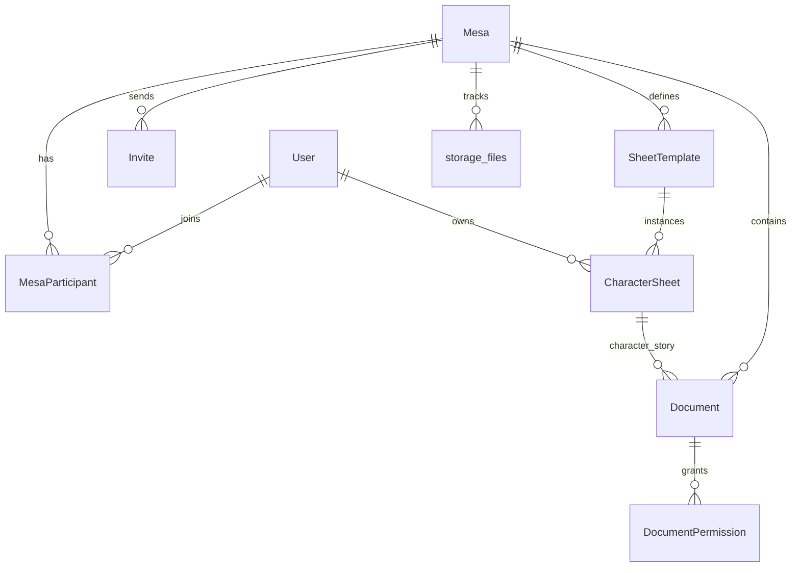

# Domain Model

> **Canonical SQL + contracts:** [database-schema.md](./database-schema.md), [json-contracts.md](./json-contracts.md)

## Entity relationship overview



## User

Platform account.

| Field | Type | Notes |
|-------|------|-------|
| id | UUID | PK |
| name | string | Display name |
| email | string | Unique, login |
| auth_provider_id | string | Supabase Auth user UUID |
| avatar_url | string | Optional |
| status | enum | `active`, `suspended`, `deleted` |
| is_admin | boolean | Global Admin flag |
| created_at | datetime | |
| last_login_at | datetime | Optional |

## Mesa

Campaign sandbox. **No cross-Mesa data access.**

| Field | Type | Notes |
|-------|------|-------|
| id | UUID | PK |
| name | string | |
| description | text | Optional |
| rpg_system | string | Free label, e.g. "D&D 5e", "Vampiro" |
| status | enum | `active`, `paused`, `finished`, `archived` |
| master_id | FK User | Sole Master (creator); immutable in MVP |
| created_by | FK User | Same as master_id |
| settings | JSON | Mesa-level flags (see below) |
| created_at | datetime | |
| updated_at | datetime | |

**Mesa settings (JSON) — proposal:**

```json
{
  "players_can_edit_own_sheet": true,
  "players_can_view_other_sheets": false,
  "character_story_requires_approval": false
}
```

## MesaParticipant

User ↔ Mesa membership. Role is per Mesa.

| Field | Type | Notes |
|-------|------|-------|
| id | UUID | PK |
| mesa_id | FK | |
| user_id | FK | |
| role | enum | `master`, `player` |
| status | enum | `pending`, `active`, `removed`, `left` |
| joined_at | datetime | |
| permissions_override | JSON | Optional granular grants; post-MVP |

## Invite

| Field | Type | Notes |
|-------|------|-------|
| id | UUID | PK |
| mesa_id | FK | |
| email | string | Invited address |
| token | string | Unique, URL-safe |
| suggested_role | enum | `player` only (Master is always creator) |
| status | enum | `pending`, `accepted`, `expired`, `cancelled` |
| expires_at | datetime | **7 days** after `created_at` |
| used_at | datetime | Set on accept — token is single-use |
| created_by | FK User | |
| created_at | datetime | |

**Rules:** Only Admin or Mesa Master creates invites. Player joins only via invite. Token is **single-use** and expires **7 days** after creation.

## SheetTemplate

JSON-defined field structure per Mesa.

| Field | Type | Notes |
|-------|------|-------|
| id | UUID | PK |
| mesa_id | FK | |
| name | string | |
| description | text | Optional |
| storage_path | string | `campaigns/{mesa_id}/templates/{id}/schema.json` |
| version | int | Incremented on schema change |
| is_seed | boolean | `true` for platform presets (e.g. D&D 5e) |
| status | enum | `active`, `archived` |
| created_at | datetime | |

**Payload:** `schema.json` in Supabase Storage — see [storage-layout.md](./storage-layout.md).

**MVP templates per Mesa:**

- Platform seeds **D&D 5e Character** template on Mesa creation (optional toggle).
- Master may create **unlimited custom templates** per Mesa (NPC sheet, monster sheet, etc.).
- Not one DB table per sheet type.

**Field types (MVP):**

| Type | MVP |
|------|-----|
| `text`, `textarea`, `number`, `checkbox` | ✓ |
| `select`, `multiselect` | ✓ |
| `group`, `repeater` | ✓ |
| `image`, `file` | ✓ — Supabase Storage path in `data` |
| `computed` | Post-MVP (Q-005) |

## CharacterSheet

| Field | Type | Notes |
|-------|------|-------|
| id | UUID | PK |
| mesa_id | FK | |
| owner_id | FK User | Player |
| template_id | FK SheetTemplate | |
| character_name | string | Cached from `data.json` for lists |
| storage_path | string | `campaigns/{mesa_id}/characters/{id}/data.json` |
| version | int | Matches Storage `versions/v{n}.json` |
| status | enum | `active`, `dead`, `retired`, `archived` |
| visibility | enum | `owner_only`, `mesa_masters`, `all_players` |
| created_at | datetime | |
| updated_at | datetime | |

**Payload:** `data.json` + optional `media/` in Storage.

## SheetTemplateVersion / CharacterSheetVersion / DocumentVersion

Postgres: `entity_id`, `version`, `storage_path` (pointer to `versions/v{n}.*`), `created_at`, `created_by`.  
Files: immutable copies under each resource's `versions/` folder in Storage.

## Document

Campaign material — rules, lore, NPCs, sessions, etc.

| Field | Type | Notes |
|-------|------|-------|
| id | UUID | PK |
| mesa_id | FK | |
| title | string | |
| type | enum | See list below; `character_story` for player narratives |
| character_sheet_id | FK | Required when `type = character_story` |
| content_format | enum | `markdown` or `structured_json` |
| storage_path | string | `content.md` or `content.json` |
| meta_storage_path | string | `meta.json` — contract `rpg.document-meta` |
| tags | string[] | Cached in Postgres for filter |
| deleted_at | datetime | Soft delete |
| visibility | enum | Same levels as permission model |
| visibility_targets | JSON | User/character IDs when scoped |
| created_by | FK User | |
| version | int | |
| created_at | datetime | |
| updated_at | datetime | |

**Document types:**

`rule`, `campaign_story`, `lore`, `npc`, `location`, `item`, `monster`, `organization`, `session`, `summary`, `freeform`, `character_story`, `attachment`, `external_link`

Session summaries use type `session` in MVP; full Sessions module is v2.

## DocumentPermission

Explicit grants when visibility is `specific_players` or `specific_character`.

| Field | Type | Notes |
|-------|------|-------|
| id | UUID | PK |
| document_id | FK | |
| grantee_type | enum | `user`, `character` |
| grantee_id | UUID | |
| created_at | datetime | |

## State machines

### Mesa.status

`active` → `paused` → `active`  
`active` → `finished` → `archived`  
Any → `archived` (soft hide)

### MesaParticipant.status

`pending` → `active` → `removed` | `left`

### Invite.status

`pending` → `accepted` | `expired` | `cancelled`

## StorageFile (registry)

One row per object in Supabase Storage. Holds `contract`, `contract_version`, `checksum_sha256`. See [database-schema.md](./database-schema.md#table-storage_files-integrity-registry).

## Mesa isolation invariant

**INV-01:** Every query for Mesa-scoped entities MUST filter by `mesa_id` from the authenticated user's membership context. No Mesa reads another Mesa's data.
