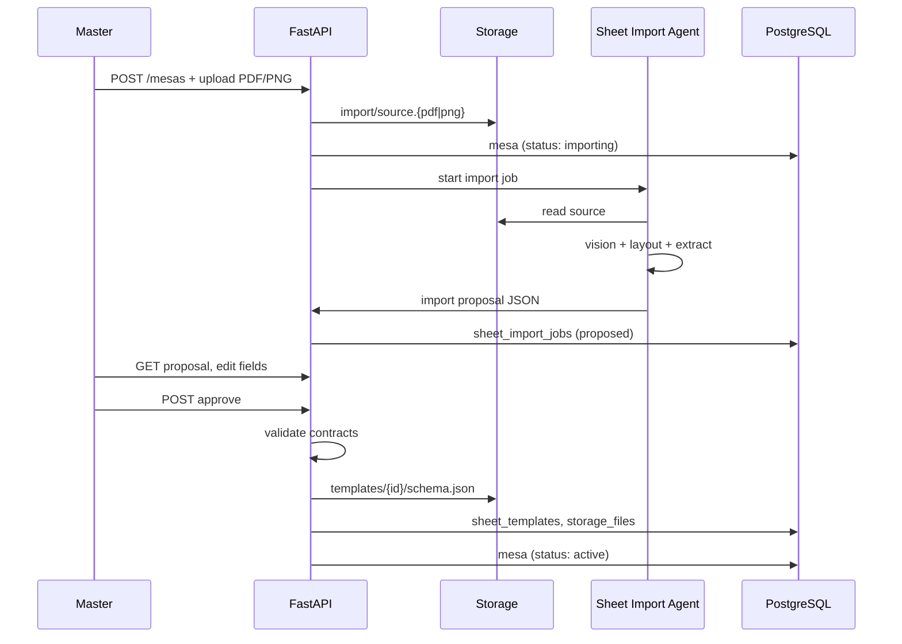

# Sheet Import Agent — Mesa Bootstrap

> **Status:** Accepted (refinement)  
> **Date:** 2026-06-11  
> **Related:** [json-contracts.md](./json-contracts.md), [database-schema.md](./database-schema.md), [dnd5e-sheet-reference.md](./dnd5e-sheet-reference.md)

## Purpose

When a Master **creates a Mesa**, the first step is importing a reference character sheet (PDF or PNG). An **AI Sheet Import Agent** reads the file, detects the RPG system layout, produces a valid `rpg.sheet-template` contract, and — if the sheet is filled — drafts `rpg.character-sheet` values for review.

This replaces a static D&D 5e seed as the default Mesa bootstrap. Platform seeds remain available as fallback.

## Mesa creation flow (updated)

```
1. Master → Create Mesa (name, rpg_system label)
2. Master → Upload reference sheet (PDF | PNG) — REQUIRED in MVP bootstrap
3. API → Store source file in Storage
4. Sheet Import Agent → Analyze + propose template (+ optional character data)
5. Master → Review & edit proposal in UI
6. Master → Approve → persist schema.json + DB rows
7. (Optional) Import additional player sheets into existing template
8. Continue → invites, documents, etc.
```



## Input constraints

| Format | Max size | Notes |
|--------|----------|-------|
| PDF | 10 MB | Single- or multi-page; agent uses page 1 for template, all pages for data |
| PNG / JPEG / WebP | 5 MB | Single page typical |
| DPI | ≥ 150 recommended | Low DPI reduces OCR/vision accuracy |

**Storage path:** `campaigns/{mesa_id}/import/source.{ext}`  
**Retention:** keep source file for audit; link from `sheet_import_jobs.source_storage_path`.

## Agent architecture

### Components

| Component | Responsibility |
|-----------|----------------|
| **Ingest** | Normalize PDF → images per page; validate mime/size |
| **Classifier** | Detect sheet family: `dnd5e_2024`, `dnd5e_2014`, `pathfinder2e`, `custom` |
| **Layout analyzer** | Vision model — locate sections, labels, field boxes |
| **Field mapper** | Map detected regions → `rpg.sheet-template` field keys |
| **Value extractor** | Read filled values → `rpg.character-sheet` `values` (if not blank) |
| **Contract builder** | Wrap in envelope; assign `contract_version` |
| **Validator** | JSON Schema + business rules from [json-contracts.md](./json-contracts.md) |
| **Confidence scorer** | Per-field and overall score; flag low-confidence for human review |

### LLM — Q-017 resolved

| Setting | Value |
|---------|-------|
| Model | **`openai:gpt-4.1-mini`** via `AGENT_MODEL` in `.env` |
| API key | `OPENAI_API_KEY` |
| Format | LangChain provider string: `openai:gpt-4.1-mini` |

Same model as the rest of the project SDLC agents. Upgrade path: change `AGENT_MODEL` only (e.g. `openai:gpt-4.1` or `openai:gpt-4o`) without code changes.

**Requirement:** model must accept **image inputs** (PDF pages rendered as PNG). `gpt-4.1-mini` is multimodal in the OpenAI API.

### Harness — LangChain Deep Agents

Built with [`deepagents`](https://docs.langchain.com/oss/python/deepagents/overview) (`create_deep_agent`), not a hand-rolled loop.

| Deep Agent capability | Use in sheet import |
|---------------------|---------------------|
| `write_todos` | Plan: classify → analyze pages → map fields → extract values → validate |
| `task` (subagents) | Delegate per-page analysis and D&D edition-specific mapping |
| Custom tools | PDF render, reference glossary, proposal submit, JSON Schema validate |
| LangGraph runtime | Durable job state, streaming progress to UI, 120s timeout |
| Human-in-the-loop | Agent stops at `proposed`; Master approves via API (not auto-persist) |

**Not used for campaign data:** Deep Agent built-in filesystem is **ephemeral workspace only** (`/workspace/{job_id}/`) for page images and drafts — not Supabase Storage.

### Model stack

| Step | Tool | Why |
|------|------|-----|
| PDF → image | PyMuPDF (`fitz`) | Deterministic; 300 DPI PNG per page |
| Orchestration | `create_deep_agent(model=AGENT_MODEL, …)` | Planning + subagent delegation |
| Vision + structure | `gpt-4.1-mini` via LangChain | Layout, labels, handwriting, checkboxes |
| Proposal output | Tool `submit_import_proposal` | Pydantic model → `sheet-import-proposal.v1` |
| Final gate | JSON Schema + [json-contracts.md](./json-contracts.md) | Fail closed before `proposed` status |

**Not MVP:** fine-tuned model; LangSmith tracing optional.

### Agent prompt strategy (summary)

1. Provide reference field glossary for detected system ([dnd5e-sheet-reference.md](./dnd5e-sheet-reference.md)).
2. Ask for **layout-first** output: sections → fields → types.
3. Separate **template fields** (empty sheet) from **instance values** (filled sheet).
4. Never invent fields not visible on the image; use `unknown_field_*` with `confidence < 0.5` for ambiguous regions.
5. Return proficiency as `select`: `none` | `proficient` | `expertise` (D&D skills).

## Output: `sheet-import-proposal` (internal contract)

Agent returns this **before** envelope wrapping. API converts to `rpg.sheet-template` + optional `rpg.character-sheet` after Master approval.

```json
{
  "job_id": "uuid",
  "detected_system": "dnd5e_2024",
  "detection_confidence": 0.94,
  "source_pages": 2,
  "template_proposal": {
    "name": "D&D 5e Character (imported)",
    "slug": "dnd5e-character-imported",
    "fields": []
  },
  "character_proposal": {
    "character_name": "Lyra",
    "values": {},
    "extraction_confidence": 0.87
  },
  "field_confidence": [
    { "key": "str", "confidence": 0.98, "source_region": "page1:ability_scores:str" }
  ],
  "warnings": [
    "Page 2 spell slots partially obscured — manual review required"
  ],
  "requires_review": true
}
```

| Field | Rule |
|-------|------|
| `requires_review` | Always `true` in MVP — Master must approve |
| `detection_confidence` | If &lt; 0.7, suggest platform seed instead |
| `character_proposal` | Omitted if upload is blank character sheet |

## Approval → persistence

On `POST /mesas/{id}/import/approve`:

1. Merge Master UI edits into proposal.
2. Build `rpg.sheet-template` envelope → write `schema.json`.
3. If character data present → build `rpg.character-sheet` → write `data.json` + `meta.json`.
4. Insert `sheet_templates`, optional `character_sheets`, `storage_files`, `sheet_import_jobs.status = approved`.
5. Set `mesas.status = active`.
6. Regenerate `manifest.json`.

Rejected import: `status = rejected`; Master can re-upload or pick platform seed `dnd5e`.

## Database: `sheet_import_jobs`

| Column | Type | Notes |
|--------|------|-------|
| `id` | uuid | PK |
| `mesa_id` | uuid | FK |
| `created_by` | uuid | Master |
| `status` | enum | `pending`, `processing`, `proposed`, `approved`, `rejected`, `failed` |
| `source_storage_path` | text | import source file |
| `source_mime` | text | |
| `detected_system` | varchar | `dnd5e_2024`, etc. |
| `proposal` | jsonb | Full `sheet-import-proposal` |
| `result_template_id` | uuid | NULL until approved |
| `result_sheet_id` | uuid | NULL — if character imported |
| `error_message` | text | On `failed` |
| `created_at` | timestamptz | |
| `completed_at` | timestamptz | |

## API endpoints (proposal)

| Method | Path | Action |
|--------|------|--------|
| POST | `/api/v1/mesas` | Create Mesa (`status: importing`) |
| POST | `/api/v1/mesas/{id}/import` | Upload PDF/PNG, enqueue agent |
| GET | `/api/v1/mesas/{id}/import` | Poll job status + proposal |
| PATCH | `/api/v1/mesas/{id}/import/proposal` | Master edits proposal |
| POST | `/api/v1/mesas/{id}/import/approve` | Persist contracts |
| POST | `/api/v1/mesas/{id}/import/reject` | Discard; optional re-upload |
| POST | `/api/v1/mesas/{id}/import/seed` | Fallback: use platform `dnd5e` seed without upload |

## Security and privacy

- Import files visible only to Mesa Master (+ Admin).
- Agent receives **no** other Mesa context — single file in, structured JSON out.
- Source files may contain player PII — same retention policy as campaign data.
- Rate limit: 5 imports per Mesa per hour (abuse prevention).

## Error handling

| Case | Behavior |
|------|----------|
| Unreadable scan | `failed` + message; offer seed fallback |
| Unknown system (`custom`) | Generic template from layout only; wider review UI |
| Partial extraction | `warnings[]`; low-confidence fields highlighted |
| Contract validation fail | Agent retry once; then `failed` |

## UI requirements (Master review)

- Side-by-side: source image (zoom) + proposed field list.
- Edit field labels, types, keys before approve.
- Toggle: "Template only" vs "Template + this character".
- Confidence badges (green / yellow / red per field).
- Button: "Use D&D 5e official template instead" (seed fallback).

## Relationship to platform seed

| Path | When |
|------|------|
| **Import agent** (default) | Master has PDF/PNG of their table's sheet |
| **Platform seed** | Master skips upload or import fails/low confidence |

Seed file `seeds/dnd5e/schema.json` remains the canonical reference for `dnd5e_2024` — agent output should converge toward it when classifying official 2024 sheets.

## Deep Agent design

### Main agent: `sheet-import-orchestrator`

```python
import os
from deepagents import create_deep_agent
from rpg_platform.agents.sheet_import.tools import SHEET_IMPORT_TOOLS
from rpg_platform.agents.sheet_import.prompts import SYSTEM_PROMPT

def create_sheet_import_agent():
    return create_deep_agent(
        model=os.environ["AGENT_MODEL"],  # openai:gpt-4.1-mini
        tools=SHEET_IMPORT_TOOLS,
        system_prompt=SYSTEM_PROMPT,
    )
```

### Custom tools

| Tool | Input | Output |
|------|-------|--------|
| `render_import_pages` | `job_id`, `storage_path` | List of workspace PNG paths + page count |
| `load_sheet_reference` | `detected_system` | Field glossary from [dnd5e-sheet-reference.md](./dnd5e-sheet-reference.md) (bundled JSON) |
| `analyze_sheet_page` | `page_index`, `image_path`, `edition` | Raw field regions + values (subagent-friendly) |
| `submit_import_proposal` | `proposal: SheetImportProposal` | Validates schema; writes to `sheet_import_jobs.proposal` |
| `validate_template_contract` | `template_proposal` | Pass/fail against `rpg.sheet-template` v1 |

Page images are passed to the model as **multimodal message content** (base64 image_url) inside `analyze_sheet_page` or via subagent messages.

### Subagents (via Deep Agents `task` tool)

| Subagent | Role |
|----------|------|
| `sheet-classifier` | Decide `dnd5e_2024` / `dnd5e_2014` / `custom`; return confidence |
| `page-layout-analyst` | One invocation per page; return sections + bounding labels |
| `contract-mapper` | Map layout → `template_proposal.fields` using reference glossary |

Orchestrator merges subagent outputs and calls `submit_import_proposal` once.

### System prompt (summary)

```
You are the RPG Platform Sheet Import Agent.
Goal: produce a valid sheet-import-proposal from an uploaded PDF/PNG.

Rules:
- Use load_sheet_reference when system is dnd5e_*.
- Never invent fields not visible on the sheet.
- Mark uncertain fields with confidence < 0.5.
- Call submit_import_proposal exactly once when done.
- Do NOT write to Supabase; only submit proposal JSON.
```

### Job execution

```python
agent = create_sheet_import_agent()
result = agent.invoke({
    "messages": [{
        "role": "user",
        "content": f"Import job {job_id}. Mesa {mesa_id}. Source: {mime}."
    }]
})
# Service parses result → sheet_import_jobs.status = proposed | failed
```

Progress: stream LangGraph events → SSE endpoint `GET /mesas/{id}/import/stream` (optional MVP).

### Dependencies (`pyproject.toml`)

```
deepagents
langchain-openai
langchain-core
pymupdf
jsonschema
```

Model resolved from `AGENT_MODEL`; `langchain-openai` uses `OPENAI_API_KEY`.

## Implementation location (future)

```
app/backend/src/rpg_platform/
├── agents/
│   └── sheet_import/
│       ├── agent.py              # create_sheet_import_agent()
│       ├── tools.py              # SHEET_IMPORT_TOOLS
│       ├── prompts.py            # SYSTEM_PROMPT + subagent prompts
│       ├── models.py             # SheetImportProposal (Pydantic)
│       ├── runner.py               # invoke + job status updates
│       └── references/
│           └── dnd5e_2024.json   # from dnd5e-sheet-reference.md
├── api/v1/routes/mesa_import.py
└── services/sheet_import_jobs.py

app/shared/contracts/
├── sheet-import-proposal.v1.schema.json
└── sheet-template.v1.schema.json
```

## MVP acceptance

- [ ] Master uploads official 2024 D&D PDF → agent proposes template with ≥ 90% of [reference fields](./dnd5e-sheet-reference.md).
- [ ] Filled PNG scan → character_name + ability scores extracted with review flagged where confidence &lt; 0.8.
- [ ] Approved output passes `rpg.sheet-template` JSON Schema validation.
- [ ] Reject + seed fallback produces valid Mesa without import.
